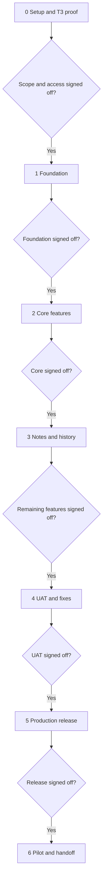

> **Owner decision, 2026-10-09:** Verified incremental Helm development commits may be pushed directly to main. This supersedes older branch/PR recommendations in this document; it does not waive evidence, private auth, environment separation or runtime target permission requirements. Main pushes may trigger Vercel deployment; keep unfinished dispatch disabled. All unrelated technical/release sign-offs remain pending.

> Published to Helm on 2026-10-09. Original reviewed specification preserved; approvals remain pending. Repository is now [https://github.com/EGA-BUILDS/helm](<https://github.com/EGA-BUILDS/helm>); dev Convex setup exists, but current updated Next.js build fails. Refer to project overview and issues for current execution status. Local relative document links identify source filenames; use the sibling Linear documents for reading.

# Implementation Plan: Helm — First Usable MVP

| Field | Value |
| -- | -- |
| Owner (builder) | Implementing developer / coding agent; assignment pending |
| Approver (sign-off) | Abdelilah Mortaki (EGAWILLDOIT) |
| Linked PRD / TRD | [MVP PRD](<PRD.md>) / [MVP TRD](<TRD.md>), both v0.1 dated 2026-10-09 |
| Start / target launch | Proposed: 2026-10-09 / 2026-10-09, conditional on access and Stage 0 proof; reschedule from actual start if needed |
| Version / date | v0.1 / 2026-10-09 — In review |

> **Binary rule:** A stage is either **Signed off** or **not done**. No "90% done", no "nearly there".
> **Gate rule:** Stage N+1 does not start until Stage N is signed off. Work found missing goes to the Change Log (Section 9), not into the current stage.
> **Evidence rule:** Sign-off needs proof (link, demo, test result), not a statement.

This plan schedules the seven agreed Must features, using Convex and the existing T3 environment. It does not claim that access, integration tests, code or deployments already exist. All stage approvals remain pending. Preparing this document does not approve the PRD, lock the TRD or authorize production launch.

**Schedule basis:** Aim for a first usable private release in one focused day only if access is ready and the T3 gate passes early. The proposed 8–10 hours below are planning allowances, not measured estimates. The following day's support checks finish Stage 6; they are not silently counted as day-one work. If integration or recovery takes longer, move the target date rather than removing acceptance requirements.

---

## 1. Status Board (check this instead of asking)

Update at the end of every working week, and after every stage or blocker during this short build. D means the actual approved implementation day; proposed D is 2026-10-09.

| \# | Stage | Planned dates | Status | Sign-off date | Blockers |
| -- | -- | -- | -- | -- | -- |
| 0 | Setup & access | D, first 1–2 hours | Not started | Pending | PRD approval/TRD lock, target mapping, credentials and hosted T3 proof |
| 1 | Foundation | D, next 1 hour | Not started | Pending | Stage 0 sign-off |
| 2 | Core features | D, next 3 hours | Not started | Pending | Stage 1 sign-off |
| 3 | Remaining features | D, next 1 hour | Not started | Pending | Stage 2 sign-off |
| 4 | Testing & fixes (UAT) | D, next 1–2 hours | Not started | Pending | Stage 3 sign-off and real acceptance issue |
| 5 | Launch | D, final 1 hour | Not started | Pending | UAT approval and production authority |
| 6 | Support & handoff | D+1, after a 24-hour pilot window | Not started | Pending | Stage 5 sign-off and pilot results |

**Overall:** At risk until hosted T3 feasibility is proven. **Next sign-off:** Stage 0, after proof and access checks. **Needs from you:** Confirm the repository/base branch, Linear project, T3 target, owner identity, safe acceptance issue and usage budget; approve the PRD and TRD before stage execution. Supply credentials through the integrations' secure setup mechanisms, not this document.

---

## 2. Stages at a Glance

At any failed gate, keep the stage unsigned, record the blocker and revised schedule, and resolve the failed criterion before advancing. A failed live integration is not replaced with a mock for sign-off.

---

## 3. Stage Details

### Stage 0: Setup & Access

| Field | Value |
| -- | -- |
| Goal | Prove the critical runtime path and establish the access needed to build |
| Owner | Builder; owner supplies access and signs off |
| Duration | Proposed 1–2 hours; reassess after the first hour if proof is blocked |
| Depends on | PRD Approved, TRD Locked; neither approval is currently recorded |

**Work:**

- [ ] Confirm the seven-feature scope, target IDs/base branch, owner identity and safe disposable T3 workspace.
- [ ] Complete TRD Section 9 access checklist. Create repository, Vercel, Convex dev/prod and Clerk configuration; use a platform URL initially. No brand assets or custom domain dependency.
- [ ] Pin compatible Node/pnpm/SDK versions and frozen lockfile; establish CI and deploy a private placeholder to a safe preview environment.
- [ ] Run a minimal hosted Convex action against the installed T3 MCP interface. Capture actual authentication/renewal, tool schemas, runtime version, provider/model discovery, permission modes and thread link behavior.
- [ ] Perform one owner-authorized disposable isolated launch. Read its state/activity, reconnect, and verify the supported credential renewal path. Confirm useful coding is possible while push/merge/deployment require human authorization.
- [ ] Inject a lost acknowledgment using a controlled adapter/proxy; establish how the exact remote thread can be reconciled. Document automated correlation if supported, otherwise the validated manual resolution procedure. Never relaunch solely because the response disappeared.
- [ ] Read the real Linear project, paginate issues and inspect blocker statuses. Record sanitized results in `docs/t3-capabilities.md` and `docs/integration-gate.md`.

**Delivers:** Private placeholder URL, reproducible development setup, actual T3/Linear capability evidence and a decision that the agreed launch/recovery contract is feasible.

**Exit criteria (sign-off):**

- [ ] PRD approval/TRD lock recorded; scope matches Section 4; all required access items are satisfied or explicitly N/A.
- [ ] Private preview opens, empty-project CI passes, and preview has no production integration credentials.
- [ ] Hosted discovery, isolated launch, observation and reconnect/renewal succeed against the actual T3 version with saved evidence.
- [ ] Lost acknowledgment has a demonstrated safe resolution path without duplicate launch.
- [ ] Linear reads/blocking relations and actual runtime/repository shipping controls are demonstrated.

**Failure signal:** No real hosted launch/observation or safe permission/recovery route after the initial 1–2-hour allowance. Record the exact gap and revise the date; do not implement an undocumented execution server or silently weaken isolation.

**Sign-off:** Pending — Abdelilah Mortaki. Date: not recorded. Evidence: integration-gate report, preview URL and CI result pending.

---

### Stage 1: Foundation

| Field | Value |
| -- | -- |
| Goal | Establish the private, durable base for execution |
| Owner / duration | Builder / proposed 1 hour |
| Depends on | Stage 0 Signed off |
| Delivers | Authenticated shell, Convex schema, backend authorization, shared adapters and deployment configuration |
| Features covered | F1; shared infrastructure for F2–F7 |

**Work:**

- [ ] Implement Clerk login/logout with an immutable server-configured owner subject. Check authorization in every public Convex query, mutation and action; scheduled helpers remain internal.
- [ ] Create the TRD tables/indexes for project/connections, issue cache/snapshots, attempts/commands/slot, observations, excerpts and notes. Establish immutable snapshot and transactional transition helpers.
- [ ] Add strict TypeScript domain types and validated Linear/T3 adapter boundaries using Stage 0 fixtures. Keep secrets server-only; implement supported encrypted token renewal when required by the proven contract.
- [ ] Add a simple responsive shell with project/issues, execution/history and connection settings routes. Display times in Africa/Casablanca; provide labeled controls, keyboard focus and textual status.
- [ ] Run typecheck, lint, backend authorization tests and build in CI.

**Exit criteria:**

- [ ] Every PRD F1 acceptance criterion passes, including direct unauthorized backend calls and a denied non-owner identity.
- [ ] Schema/indexes and transaction helpers match the locked TRD; no integration secrets appear in client responses or logs.
- [ ] Owner login/logout and usable desktop/basic narrow-screen navigation are demonstrated.
- [ ] Foundation CI passes; no open critical or high defect.

**Sign-off:** Pending — Abdelilah Mortaki. Date: not recorded. Evidence: auth demo, denied-access results and CI result pending.

---

### Stage 2: Core Features

| Field | Value |
| -- | -- |
| Goal | Complete a real prepared-issue launch and observed T3 handoff |
| Owner / duration | Builder / proposed 3 hours |
| Depends on | Stage 1 Signed off |
| Features covered | F2, F3, F4, F5 — all Must |

**Work:**

- [ ] **F2:** Save one project mapping; show Linear/T3 health, last check and failures. Populate provider/model choices only from the proven live catalog.
- [ ] **F3:** Build paginated read-only issue list/detail with objectives, acceptance criteria and blocker status. Block completed/canceled issues and unresolved/canceled/unreadable blockers. Require owner readiness/base confirmation tied to fresh inputs.
- [ ] **F4:** Implement digest revalidation, durable request ID/payload hash, transactional one-slot reservation and atomically scheduled dispatch. Claim the command before the external call; dispatch once. Handle definite rejection separately from unknown outcome.
- [ ] **F4:** Implement reconciliation: recheck remote evidence, validate attaching an exact thread, or record a supported no-launch inspection after the dispatcher has settled. Late/conflicting evidence freezes dispatch. Repeated clicks and retries reuse intent rather than creating another command.
- [ ] **F5:** Observe active threads through short scheduled reads independent of browser presence, with generation checks and recovery cron. Target every 60 seconds; show stale after 120 seconds without successful observation. Store bounded excerpts and safe observation facts.
- [ ] **F5:** Show requested and observed settings separately, thread/workspace references when available, errors and T3 handoff. Release the slot only on fresh confirmed inactivity; preserve it for waiting/unknown states. Check previously linked resumed threads at preflight.

**Delivers:** Owner can select one real prepared issue, choose a supported provider/model, launch once, observe its actual thread and open T3 for review.

**Exit criteria:**

- [ ] Every PRD F2–F5 acceptance criterion passes with recorded results; live integration criteria use the actual services.
- [ ] Owner watches the real issue flow; thread identity and provider/model display reflect requested versus observable facts accurately.
- [ ] Double-click/concurrent-tab, changed digest, lost acknowledgment and late-receipt tests demonstrate no blind duplicate launch.
- [ ] Browser closure, observer failure and outage tests preserve records/slot and show truthful stale/unknown states.
- [ ] No open critical or high defect on these features; CI passes.

**Sign-off:** Pending — Abdelilah Mortaki. Date: not recorded. Evidence: live demo, attempt/thread reference and core test results pending.

---

### Stage 3: Remaining Features

| Field | Value |
| -- | -- |
| Goal | Make the application useful when the owner returns later |
| Owner / duration | Builder / proposed 1 hour |
| Depends on | Stage 2 Signed off |
| Features covered | F6, F7 — both Must, not optional polish |

**Work:**

- [ ] **F6:** Add manual blocker and recommended-next-action notes with required-field validation, author/time and safe save errors. Retain unsaved text on failure. Notes never overwrite observed runtime status.
- [ ] **F7:** Add paginated execution history linking immutable issue/settings snapshots, attempts, thread references, milestone observations and notes. Preserve earlier attempts and show missing observed fields explicitly.
- [ ] Finish English empty/error/loading copy, handoff links and a clear distinction between a finished turn and reviewed/verified code. Cap activity at the latest 100 excerpts per attempt, at most 4 KiB each.

**Exit criteria:**

- [ ] Every PRD F6/F7 acceptance criterion passes.
- [ ] Saved notes/history survive browser close/reopen and a compatible backend redeployment; unsaved note text survives a failed save within the open form.
- [ ] Snapshot immutability, pagination and excerpt retention limits pass checks.
- [ ] No UI claims verification, merge, deployment or shipment merely because a turn ended; no open critical or high defect.

**Sign-off:** Pending — Abdelilah Mortaki. Date: not recorded. Evidence: return-to-work demo and persistence results pending.

---

### Stage 4: Testing & Fixes (UAT)

| Field | Value |
| -- | -- |
| Goal | Prove the complete seven-feature PRD and resolve release-blocking defects |
| Owner / duration | Builder runs checks; owner performs UAT / proposed 1–2 hours |
| Depends on | Stage 3 Signed off |
| Delivers | Acceptance report, defect log, fixes and owner release recommendation |

**Work:**

- [ ] Map every PRD "Done when" item and Section 10 release requirement to a test case and evidence. Mark pass/fail/blocked explicitly; do not substitute a generic coverage percentage.
- [ ] Walk the full real owner flow on desktop Chrome: sign in → refresh → confirm readiness → choose model → launch → observe → open exact T3 thread → review/test manually → save note → reopen history.
- [ ] Test basic narrow-screen use, keyboard access, English copy and Africa/Casablanca timestamps. Check performance/retention against PRD Section 5, not the template's illustrative load-time targets.
- [ ] Run the recovery/security cases below, using controlled fault injection for unsafe failure scenarios and a real integration smoke test for external behavior.
- [ ] Export records and restore once into dev with dispatch disabled. Rehearse compatible code rollback and remote reconciliation before dispatch can be enabled after restore.
- [ ] Record pilot service usage and known limitations. Log missing work in Section 9; fixes needed to meet existing acceptance keep the stage unsigned until resolved.

| Test group | Required proof |
| -- | -- |
| Identity and credentials | Owner allowed, other identity denied, public backend calls protected, secrets redacted |
| Issue readiness | Canceled/completed selection rejected; canceled/unreadable blocker rejected; changed content/settings/base invalidates confirmation |
| Dispatch contention | Duplicate request deduplicated; same ID with changed payload rejected; concurrent tabs reserve one slot |
| Uncertain outcomes | Remote acceptance with lost response, worker crash and late receipt retain uncertainty; validated reconciliation cannot blind-relaunch |
| Observation and lifecycle | Stale generation cannot overwrite fresh state; outage keeps slot; finished turn releases only after confirmed idle; externally resumed linked work blocks preflight |
| Durable return | Browser closure and backend redeployment preserve observation/history; note failure preserves unsaved form text; prior snapshots remain immutable |
| Recovery and permissions | Dev restore/rollback rehearsed; actual runtime/repository controls demonstrated; no completion claim exceeds evidence |

**Exit criteria:**

- [ ] All seven Must features and every release-blocking PRD acceptance/recovery case pass; none blocked or waived silently.
- [ ] Zero open critical or high defects; low defects have documented owner disposition.
- [ ] PRD non-functional targets and TRD security checks pass with recorded evidence.
- [ ] Backup/restore and rollback rehearsal succeed in a safe environment with dispatch protected.
- [ ] Owner completes real UAT and signs the report; runtime/target/authorization open questions are resolved.

**Sign-off:** Pending — Abdelilah Mortaki. Date: not recorded. Evidence: `docs/acceptance-report.md`, CI result and defect log pending.

---

### Stage 5: Launch

| Field | Value |
| -- | -- |
| Goal | Release a private application the owner can actually use |
| Owner / duration | Builder deploys only with owner production authorization / proposed 1 hour |
| Depends on | Stage 4 Signed off |

**Go / No-go checklist:**

- [ ] Stage 4 signed off and owner authorizes the specific production release.
- [ ] Production Vercel URL/HTTPS, Convex deployment, Clerk callback/issuer, owner allowlist and project mapping are correct.
- [ ] Production credentials stay server-side; previews remain isolated; provider access and actual shipping protections verified.
- [ ] Deploy additive compatible backend before frontend, with new dispatch initially disabled.
- [ ] Operational logs/dashboards checked; owner knows where to inspect failures and staleness. Separate alert service is N/A for this release.
- [ ] Rollback procedure in Section 6 rehearsed; launch window and owner availability agreed.

**Exit criteria:**

- [ ] Production URL allows the owner and denies the test identity; connection/readiness/history smoke checks pass.
- [ ] One explicitly authorized safe production launch reaches the exact observed T3 thread; no duplicate/unknown conflict remains unresolved before routine dispatch is enabled.
- [ ] Production deployment/commit IDs, smoke evidence, initial usage and known limits are recorded.
- [ ] No critical or high defect in the immediate release smoke; following 24-hour stability belongs to Stage 6.

**Sign-off:** Pending — Abdelilah Mortaki. Date: not recorded. Evidence: production URL, deployment references and smoke results pending.

---

### Stage 6: Support & Handoff

| Field | Value |
| -- | -- |
| Goal | Validate daily use and leave a usable runbook |
| Owner | Builder prepares handoff; owner accepts |
| Depends on | Stage 5 Signed off |
| Support window | Proposed 24-hour personal pilot after release; extend if defects prevent acceptance. No paid support commitment is implied |

**Work:**

- [ ] Inspect service errors, stale attempts, actual provider/Convex usage and unresolved commands after the pilot.
- [ ] Demonstrate return-to-work and manual T3 review with the owner.
- [ ] Deliver repository/deployment links, pinned setup instructions, T3 contract evidence, acceptance report, known limits and runbook for credentials, disabled dispatch, reconciliation, restore and rollback. Credentials remain in approved secret stores, not the handoff document.
- [ ] Record later requests separately: feature scheduling, parallelism, subagents, Linear writeback, automated verification/merge and release evidence are not added to this release.

**Exit criteria:**

- [ ] No open critical or high defect after the pilot; unresolved uncertain attempts are safely reconciled or visibly blocked with an owner-approved next action.
- [ ] Pilot usage/cost observations and any required budget decision are recorded.
- [ ] Handoff pack is complete and owner can follow the recovery/runbook steps.
- [ ] Owner completes walkthrough and final acceptance.

**Sign-off:** Pending — Abdelilah Mortaki. Date: not recorded. Evidence: pilot report, handoff/runbook and acceptance pending.

---

## 4. Traceability: Features to Stages

| PRD feature | Priority | Stage | Status |
| -- | -- | -- | -- |
| F1 Private owner login | Must | 1 | Not started |
| F2 One project and connected services | Must | 2 | Not started |
| F3 Linear issue list and readiness | Must | 2 | Not started |
| F4 Launch one issue | Must | 2 | Not started |
| F5 Live execution page and T3 handoff | Must | 2 | Not started |
| F6 Blocker and next-action notes | Must | 3 | Not started |
| F7 Persistent execution history | Must | 3 | Not started |

Every PRD feature appears here once. If it isn't in this table, it isn't scheduled. Stages 0/4/5/6 prove, test, release and support these same features; they do not create additional product scope.

---

## 5. Roles (RACI)

R = does the work, A = signs off, C = consulted, I = informed. Builder assignment is pending; Abdelilah is both approver and project/context owner. An implementing agent does not sign its own release approval.

| Activity | Builder | Approver | Content owner | Other |
| -- | -- | -- | -- | -- |
| Scope & priorities | C | A | R: owner supplies issue/context | N/A |
| Build | R | A / I | C | Platforms provide services, not sign-off |
| Content / assets | C | A | R: owner; brand assets N/A | N/A |
| Stage sign-off | R: provides proof | A | C | N/A |
| UAT | R: checks/fixes | A / R: real use | C | N/A |
| Go / No-go | R: readiness evidence | A | I | N/A |
| Access, secrets & budget | C: setup guidance | A / R | N/A | Owner account administrators if needed |

---

## 6. Launch & Rollback Plan

| Item | Plan |
| -- | -- |
| Launch window | End of approved D after UAT, with owner available; exact time pending. Use Africa/Casablanca |
| Rollback trigger | Unauthorized access/secret exposure, duplicate dispatch, unsafe slot release, conflicting late receipt, broken history, or critical/high production defect |
| Rollback steps | Disable new dispatch server-side first; preserve safe observation. Record pending/dispatching/unknown commands. Restore compatible previous Convex functions and Vercel build. Reconcile remote thread facts before re-enabling. Never erase attempts or infer that rollback stopped T3 work |
| Data restore | Only after explicit incident decision; restore in safe environment with dispatch disabled, then reconcile remote reality. Older backups can omit already-issued launches |
| Recovery timing | Measure during Stage 4 rehearsal; no invented under-X-minutes guarantee |
| Decision maker | Abdelilah Mortaki authorizes rollback/re-enable; builder executes documented safe steps |
| Comms | Record incident, affected attempts, current safety state and next action in project handoff/status notes; report to owner in this conversation. No third-party messaging required |

---

## 7. Dependencies & Risks

| Item | Type | Needed by | Owner | Status | If late |
| -- | -- | -- | -- | -- | -- |
| PRD approval / TRD lock | Dependency | Stage 0 start | Owner | Pending | Stage execution waits; document preparation is complete independently |
| Repo/base, Linear/T3 mapping and safe issue | Dependency | Stage 0 | Owner | Not supplied | No live proof; target date moves |
| Vercel/Convex/Clerk/Linear access | Dependency | Stage 0 | Owner | Untested for this app | Resolve access; do not substitute production secrets in preview |
| Hosted T3 authentication, renewal and isolation | Critical risk | Stage 0 sign-off | Builder / owner | Unverified installed contract | Stop dependent stages; document gap and revise plan |
| Lost-response correlation/manual resolution | Critical risk | Stages 0/2 | Builder | Unproven | No routine launch release until safe reconciliation exists |
| Git permission enforcement | Critical risk | Stage 0 and UAT | Owner / builder | Unverified | No real coding acceptance with uncontrolled shipping rights |
| Integration exceeds one-day allowance | Schedule risk | Every stage | Builder | Material uncertainty | Move date; preserve safety and acceptance scope |
| Owner unavailable for stage gates | Dependency | Every gate | Owner | Availability pending | Record Awaiting sign-off; next stage waits |
| Usage budget/platform caps | Cost risk | Stage 5 routine use | Owner | Budget pending | Record usage; seek owner decision before paid upgrades; pause routine use if necessary |
| Broader product scope creeps in | Scope risk | Every stage | Builder / owner | Controlled by Section 4 | Put requests in Section 9 and schedule a later release |

**Feasibility judgment:** Proceed with a bounded pilot after Stage 0 proof. The strongest objection to the one-day target is that hosted auth, workspace safety and lost-response handling are not ordinary dashboard tasks; an installed capability gap can consume the day. Convex remains the selected backend, but it cannot make a remote T3 launch transactional. Evidence supporting the date would be a real hosted launch/read/reconnect and safe recovery within the initial gate allowance. Evidence against it would be an unsupported auth flow, unavailable isolated workspace or unresolvable launch ambiguity. The safe alternative is to revise the launch date while retaining the seven features, not call a read-only mock the usable MVP.

---

## 8. Communication Rhythm

| What | When | Who | Format |
| -- | -- | -- | -- |
| Status board update | Weekly; also after every stage/blocker during the one-day build | Builder | This doc, Section 1 |
| Progress update | At meaningful findings during active work | Builder to owner | Concise completed/uncertain/next-step note |
| Demo | End of each stage before advancing | Builder + approver | Live walkthrough or recording plus test evidence |
| Escalation | Immediately for auth/safety/unknown launch; when Stage 0 exceeds allowance | Builder to owner | Exact blocker, evidence, safe next action and date impact |
| Pilot review | After the proposed 24-hour window | Builder + owner | Error/usage report, handoff and final acceptance |

---

## 9. Change Log

New requests land here, not in the running stage. Missing work is logged here as required by the gate rule; an unmet existing acceptance criterion still blocks sign-off. A locked TRD technical change also requires its Section 11 decision entry and owner approval.

| Date | Request | Impact (time / cost / stage) | Decision | Approved by |
| -- | -- | -- | -- | -- |
| 2026-10-09 | Initial plan from supplied template and reviewed PRD/TRD | Seven Must features; conditional day-one release plus next-day pilot | Proposed for review; no execution/sign-off claimed | Pending owner review |

---

## 10. Decision Gates Summary

| Gate | After stage | Who signs | Proof required |
| -- | -- | -- | -- |
| Scope lock & feasibility | 0 | Abdelilah Mortaki | PRD approved, TRD locked, access checklist, actual hosted T3/Linear proof, safe recovery and permission evidence |
| Foundation OK | 1 | Abdelilah Mortaki | Auth/denied-access demo, schema/security checklist and passing CI |
| Core features OK | 2 | Abdelilah Mortaki | F2–F5 "Done when" results, real thread demo, contention/recovery results |
| Remaining features OK | 3 | Abdelilah Mortaki | F6/F7 "Done when" results, note/persistence/retention evidence |
| UAT OK | 4 | Abdelilah Mortaki | Full acceptance report, no critical/high defects, recovery rehearsal and real owner use |
| Go / No-go and release acceptance | 5 | Abdelilah Mortaki | Go approval before deployment, then production checklist/smoke evidence for stage sign-off |
| Final acceptance | 6 | Abdelilah Mortaki | 24-hour pilot results, measured usage, runbook/handoff and owner walkthrough |

Immediate next action when execution is authorized: complete the Stage 0 access and hosted integration proof. Do not begin a larger autonomy engine, second VM server or shipping integration.
