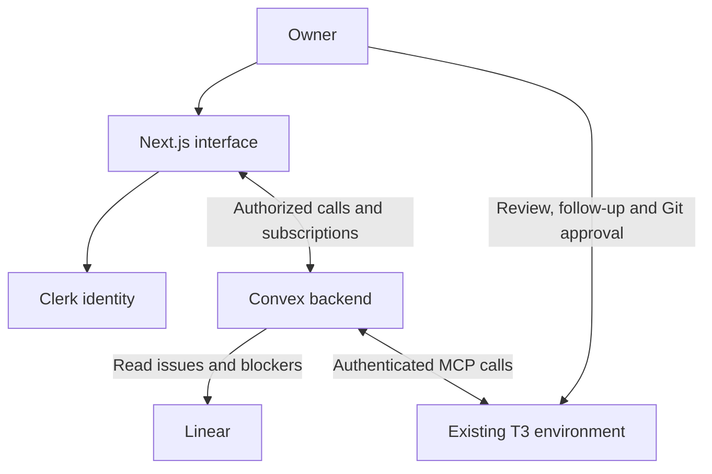

> **Owner decision, 2026-10-09:** Verified incremental Helm development commits may be pushed directly to main. This supersedes older branch/PR recommendations in this document; it does not waive evidence, private auth, environment separation or runtime target permission requirements. Main pushes may trigger Vercel deployment; keep unfinished dispatch disabled. All unrelated technical/release sign-offs remain pending.

> Published to Helm on 2026-10-09. Original reviewed specification preserved; approvals remain pending. Repository is now [https://github.com/EGA-BUILDS/helm](<https://github.com/EGA-BUILDS/helm>); dev Convex setup exists, but current updated Next.js build fails. Refer to project overview and issues for current execution status. Local relative document links identify source filenames; use the sibling Linear documents for reading.

# TRD: Helm — First Usable MVP

| Field | Value |
| -- | -- |
| Owner | Abdelilah Mortaki (EGAWILLDOIT) |
| Status | In review |
| Linked PRD | [PRD.md](<PRD.md>) — reviewed v0.1, 2026-10-09 |
| Version / date | v0.1 / 2026-10-09 |

> **Lock rule:** Once Status = Locked, Sections 2-6 only change through an entry in Section 11 (Decision Log), with a reason and an owner's approval.
> **Lean rule:** Fill what the build needs. An empty section is fine if you write "N/A because ...".

This document specifies implementation of the seven PRD features. No deployment, live T3 test or implementation is claimed complete. Recommendations remain proposed unless expressly selected by the owner; do not mark this document Locked without owner approval.

---

## 1. Goals & Quality Priorities

**What the system does** (2-3 sentences):

A private Next.js application reads one Linear project's issues and launches one prepared issue through the existing T3 environment. Convex retains dispatch intent, observed thread state, notes and history, and updates the interface through reactive queries. Detailed agent interaction, testing and Git authorization remain in T3 and existing repository tools.

**Top 3 quality goals** (rank them; when two conflict, the higher one wins):

| Rank | Quality | Concrete target |
| -- | -- | -- |
| 1 | Safe and truthful execution | No blind redispatch after an uncertain launch; atomic one-slot reservation; unknown/stale states visible; owner authorization enforced in backend |
| 2 | Recoverability | Browser closure/redeployment preserves records; a crashed observer is repaired; lost-response resolution is auditable |
| 3 | Small operational footprint | Native Convex scheduling, one project/environment, bounded excerpts and 60-second active observation; no second coding runtime |

**PRD traceability** (which PRD features drive technical choices):

| PRD feature | Technical impact |
| -- | -- |
| F1 Private login | Clerk JWT validation and immutable owner subject allowlist in every public function |
| F2 Connections | Fixed project mapping, server-only credentials, health checks and runtime capability record |
| F3 Issue readiness | Paginated Linear reads; immutable snapshots and revision-bound confirmations |
| F4 Single issue launch | Durable command, request deduplication, atomic slot, isolated T3 thread and explicit reconciliation |
| F5 Observation/handoff | Short scheduled reads, subscriptions, stale threshold and verified T3 thread reference |
| F6 Blocker notes | Validated owner mutations; note content distinct from observed state |
| F7 History | Durable execution records and paginated attempt history; no overwriting earlier attempts |

---

## 2. Constraints (non-negotiable inputs)

| Type | Constraint | Source |
| -- | -- | -- |
| Technical | Convex is the primary backend; existing T3 VM performs coding | Owner choice and PRD Sections 3/6 |
| Technical | One configured project/environment and one occupied Hub execution slot | PRD F2/F4 |
| Technical | No automatic feature dispatch, subagent UI, provider fallback, Linear writeback or shipping integrations | PRD Section 3 |
| Technical | External launch must use a supported authenticated T3 interface; isolated workspace is required | PRD F4 |
| Budget | Personal budget not supplied; record usage and use hard usage controls where available | PRD Sections 5/9 |
| Organizational | Planning stays in ChatGPT/Linear; review and Git authorization stay outside the Hub | Agreed workflow |
| Legal / data | No legal residency requirement supplied; keep repository context and credentials private | PRD F1 and Section 5 |
| Deadline | One focused implementation day is a conditional target, not a guarantee | PRD Section 7 |

No speculative team system, event-sourcing platform or microservice decomposition in this release.

---

## 3. Context & Connected Systems

**System context diagram:**



**Every system we talk to:**

| System | Purpose | Direction | Method (API / webhook / DB / file) | Auth | Owner | Access ready? | If it's down |
| -- | -- | -- | -- | -- | -- | -- | -- |
| Clerk | Login and identity verification | Browser/backend exchange | SDK/JWT | Clerk session and configured issuer | Owner | Not established for this app | Deny new authenticated operations; preserve background records |
| Convex | Application state, queries and scheduling | Both | SDK/functions | Validated Clerk JWT; deploy key for CI only | Owner | Not established | Show backend connection failure; do not dispatch from browser |
| Linear | Read project/issues/blockers | Outbound reads | GraphQL/SDK | Server-side personal API key with minimum required read access | Owner | Untested for this app | Cached data visibly stale; preflight fails |
| T3 | Discover/launch/read threads | Outbound requests, inbound responses | Supported HTTP MCP via T3 Connect | Supported delegated OAuth/session flow, proven during gate | Owner | Existing service reported; hosted contract unverified | Retain slot and history; retry reads, reconcile writes |
| Vercel | Serve Next.js and any required auth callback | Browser requests; CI deployment | Managed hosting | Vercel account/deploy permissions | Owner | Not established | UI unavailable; Convex scheduled observation remains independent |

**Data exchanged per system:**

* Clerk: identity subject/issuer and authentication token. Never log raw tokens. Do not infer authority from a client-supplied email.
* Linear: project ID; issue ID/identifier/title/description/status category/priority/updatedAt/URL; blocking relations and blocker status. Import/refresh uses pagination; launch performs fresh reads. No webhooks/writeback in v0.1.
* T3: environment/project identity, capabilities, provider/model identifiers, isolated launch settings, issue instruction snapshot and supported execution permission mode. Read responses include thread ID, turn/state/activity and workspace fields only when exposed. One launch command; active observation scheduled every 60 seconds; explicit connection/refresh/reconciliation reads on demand.
* Convex/browser: safe view models and command IDs. No Linear API key, T3 bearer/refresh token or deploy key returned to clients.
* Vercel: app assets, auth configuration and optional minimal T3 authorization callback. It does not run the observation loop.

Exact T3 tool names, schemas, authentication renewal and supported deep links must be captured from the installed version during the integration gate. The interface below is an application adapter contract, not a claim about upstream tool names.

---

## 4. Tech Stack

| Layer | Choice | Version | Why | Alternatives rejected (and why) |
| -- | -- | -- | -- | -- |
| Frontend | Next.js App Router, React | Pin compatible stable versions during bootstrap | Hosted authenticated interface | Separate SPA/API split adds another deployable |
| Styling / UI kit | Tailwind CSS; small reusable components | Pin stable compatible version | Three simple screen areas | Large design-system build exceeds scope |
| Backend / API | Convex queries, mutations and short actions | Pin stable convex SDK | One authoritative backend | Duplicate Next.js business API risks divergent state |
| Language(s) | TypeScript strict mode | Pin compatible stable version | Shared types, adapters and state logic | Separate Python backend unnecessary for this new MVP |
| Database | Convex document database | Managed runtime | Transactions plus reactive reads | Supabase/Postgres not selected for this release |
| Auth | Clerk with documented Convex integration | Pin compatible stable SDK | Established identity integration | Custom auth increases one-day scope |
| File storage | N/A because large artifacts/uploads are out of scope | N/A | Store bounded excerpts in documents | No extra storage integration |
| Email / notifications | N/A because notifications are out of scope | N/A | Clerk handles required identity flows | No app mail service |
| Payments | N/A because personal single-user MVP | N/A | No billing flow | No payment integration |
| Analytics / monitoring | Structured sanitized logs; Convex/Vercel dashboards | Managed | Operational diagnostics and pilot usage | Separate analytics/observability service deferred |

**Solution strategy** (the 3-5 big ideas that shape everything):

1. Convex owns application state and APIs; Next.js renders the interface. Plain TypeScript modules implement status normalization/readiness rules.
2. Use native scheduled actions plus transactional records, not Convex Workflow or [Trigger.dev](<http://Trigger.dev>) initially. F1-F7 require no long multi-step autonomy; add a workflow component only through a documented need.
3. Commit launch intent and slot reservation before calling T3. External side effects are not part of Convex transactions.
4. Treat requested settings, observed facts and owner notes as separate data. Turn completion is never code verification or shipment.
5. Keep external calls bounded; coding stays on the VM. Reconnect MCP for each action rather than assuming a process/socket survives across invocations.

Versions are intentionally not invented. The builder records exact SDK/runtime versions and lockfile after the hosted gate. Proposed runtime: a supported Node LTS and pnpm, pinned only after verifying hosting and dependency compatibility.

---

## 5. Architecture

### 5.1 Main building blocks

| Block | Responsibility | Talks to | Tech |
| -- | -- | -- | -- |
| Web app | Project/issue list, execution detail/history, compact connection settings | Clerk, public Convex functions | Next.js/React |
| Authorization helpers | Validate owner identity and resource ownership | Convex auth/config | Shared backend helpers |
| Issue adapter/preflight | Refresh Linear data and produce revision-bound readiness snapshot | Linear, Convex mutations | Short action + GraphQL adapter |
| Launch dispatcher | Reserve command/slot, call supported T3 launch once, persist receipt | T3, internal Convex mutations | Short Node action if MCP SDK needs Node |
| Observer/recovery jobs | Read linked thread, persist state, schedule next read, repair missed scheduling | T3, Convex scheduler | Actions + mutations + periodic cron |
| Records | Issue snapshots, attempts, commands, slot, observations and notes | Authorized functions | Convex indexed tables |
| Optional OAuth callback | Complete supported T3 authentication when required | T3 authorization endpoint, encrypted credential store | Minimal server endpoint; location decided by contract |

**Proposed public application operations:** `getProject`, `listIssues`, `getIssue`, `listExecutions`, `getExecution`, `checkConnections`, `refreshIssues`, `prepareLaunch`, `launchIssue`, `refreshExecution`, `resolveLaunch`, `saveBlockerNote`. All accept validated arguments and enforce owner authorization. Queries never call external APIs. Internal dispatch, observation, token storage and slot helpers are not public operations.

`prepareLaunch` returns a readiness digest after fresh issue/blocker/target reads. Confirmations are bound to this digest. `launchIssue` re-reads external inputs and rejects changed digests before reservation. The digest covers issue content/revision, blocker states, configured project/base and selected settings; never trust a browser snapshot as authoritative.

### 5.2 Key flows (1 to 3 most important)

**Flow 1 — Launch and acknowledgment**

```mermaid
sequenceDiagram
    participant U as Owner
    participant C as Convex action
    participant D as Convex records
    participant T as T3
    U->>C: Launch with request ID and readiness digest
    C->>T: Validate target, settings and prior thread inactivity
    C->>D: Reserve slot, save snapshot/command, schedule dispatch
    D-->>U: Attempt ID, pending
    C->>D: Claim pending command as dispatching
    C->>T: Supported isolated launch
    alt Receipt received
        T-->>C: Thread identity
        C->>D: Save receipt and schedule observation
    else Outcome uncertain
        C->>D: Record unknown; retain slot
    end
```

The sequence groups public preflight and internal scheduled dispatch under the action participant. External Linear refresh is also performed during preflight. Reservation and scheduling occur in one mutation. Deduplicate by owner/request ID and verify the payload hash: same request/same payload returns the original attempt; same request/different payload is rejected. A project-slot document is created once during setup and transactionally updated, so simultaneous tabs cannot both reserve it.

Before launch, scheduled dispatch rechecks authorization, target, issue revision and prior linked threads. Changed readiness fails safely before any launch. The compare-and-set claim permits only `pending -> dispatching`; any subsequent invocation encountering dispatching/acknowledged/unknown performs no launch. Persist dispatch start time. If execution dies before receipt persistence, the watchdog marks it unknown, never pending. A definitive remote rejection can release the slot; network/timeout/parse errors after possible acceptance cannot.

**Flow 2 — Observation and inactivity**

1. Observer claims a read lease and generation token, then reads the recorded environment/project/thread. Outdated generations cannot overwrite newer observations.
2. A mutation records normalized state, last successful observation and a bounded excerpt, then schedules the next read if active. Poll every 60 seconds; stale means more than 120 seconds since success. Scheduled time is a target, not external availability assurance.
3. Keep the slot for pending/running/waiting-for-input/unknown. Release only on a fresh response confirming idle after a finished turn, failed or interrupted; absence of activity is insufficient.
4. Stop routine polling when inactive; refresh on page open/explicit Refresh. Before any later launch, recheck previously linked threads for resumed work. External resumption can race this check; the cap covers Hub dispatch, not all activity an owner independently creates or resumes in T3.
5. A 60-second recovery cron checks only indexed due attempts, bounded to 20 per run. Repair lost observation scheduling/expired read leases. An expired observation lease never releases the execution slot or authorizes a new coding thread.

Read operations may retry with backoff. During outages retain records/slot and schedule bounded retries with a maximum five-minute interval, visibly stale. The watchdog repairs records after redeployment; it cannot inspect the browser or restore a provider process.

**Flow 3 — Resolve an uncertain launch**

1. Owner chooses Recheck. Use proven correlation metadata to find the exact thread; a matching title alone is insufficient.
2. If found, validate environment/project and record the thread receipt; continue observation.
3. Otherwise allow owner attachment of the inspected exact thread ID, or an explicit attestation that no thread was launched, including inspection time and evidence/reference.
4. An active dispatcher must have settled or exceeded its configured request/action deadline and been marked unknown before a no-launch attestation can release the slot. Late receipts/conflicting evidence freeze fresh dispatch and surface a conflict.
5. Retain resolution actor/time/reason; no-launch resolution does not redispatch the old command. A fresh launch uses a new request ID and preflight. This path is manual reconciliation, not an exactly-once guarantee.

### 5.3 Data model (high level)

| Entity | Key fields | Relations | Source of truth |
| -- | -- | -- | -- |
| Project | ownerSubject, name, repoRef, linearProjectId, t3EnvironmentId, t3ProjectId/path, baseRef | One configured project | Deployment config plus validated target mapping |
| Connection | projectId, kind, lastCheckAt, lastSuccessAt, safeError, capabilityVersion | Project | Actual integration checks |
| IntegrationSecret | encrypted token payload, keyVersion, expiresAt, credentialRevision | Connection | Supported token flow; internal-only access |
| IssueCache | linearId, identifier, title, description, statusCategory, priority, updatedAt, blocker summaries, fetchedAt | Project | Linear; cache is replaceable |
| IssueSnapshot | source revision/digest, issue and blocker values, readiness confirmations, confirmedBy/At | Attempt | Immutable launch-time inputs |
| ExecutionAttempt | projectId, snapshotId, commandId, requestedSettings, observedSettings, threadId, workspaceRef, raw/normalized state, freshness timestamps, observerGeneration, nextObserveAt | One issue attempt | Hub intent plus T3 observations |
| LaunchCommand | requestId, payloadHash, state, dispatchStartedAt, deadlineAt, receipt, safeError, resolution actor/time/evidence | Attempt | Durable dispatch/reconciliation record |
| ProjectSlot | projectId, occupiedByAttemptId | Attempt | Transactional Hub capacity reservation |
| ActivityExcerpt | attemptId, observedAt, type, bounded text/sourceRef | Attempt | T3 read, explicitly identified |
| MilestoneObservation | attemptId, time, turnId when available, state transition | Attempt | Persisted observed transitions |
| BlockerNote | attemptId, completedWork, blocker, remainingWork, nextAction, optional refs, updatedBy/At | Attempt | Owner entry |

Indexes: project/owner; issue project + Linear ID; attempts project + start time and due time; commands owner + request ID; activity attempt + time; notes attempt. Use transactional checks to enforce logical uniqueness: Convex indexes are not assumed to be SQL unique constraints. Validate IDs belong to the configured project in every public function.

Retention & deletion rules: snapshots, attempts, commands, notes and milestones remain until a separately implemented owner deletion policy. Keep at most 100 excerpts per attempt, each at most 4 KiB; prune in the observation mutation. Do not store full transcripts or tokens. No delete UI in v0.1. Operator-managed backups/exports must preserve owner identifiers and exclude readable integration secrets from ordinary exports.

Command states: pending, dispatching, acknowledged, rejected, unknown, resolved_no_launch. Execution states: launch_pending, running, waiting_for_input, turn_finished, failed, interrupted, unknown. Freshness and owner blocker notes are separate dimensions. A raw unsupported state maps to unknown, not finished.

---

## 6. Hosting & Deployment

| Item | Choice | Region / notes |
| -- | -- | -- |
| App hosting | Vercel | Minimal Next.js deployment; no persistent socket or observer hosted here |
| Database hosting | Convex Cloud | Select EU region if available within chosen plan; record exact region at provisioning; no mandatory residency claim |
| Domain & DNS | Vercel-generated URL initially | Custom domain is not required for v0.1 |
| CDN / assets | Vercel default | No external asset pipeline |
| SSL / certificates | Managed platform HTTPS | T3 Connect MCP must also be reachable over authenticated HTTPS |

**Environments:**

| Env | URL | Deploys from | Data |
| -- | -- | -- | -- |
| Dev | localhost + separate Convex dev deployment | Feature branch | Fixtures/disposable project; explicit opt-in for real T3 probes |
| Staging | N/A because one-day MVP uses a controlled preview | N/A | N/A |
| Preview | Vercel preview URL, separate dev/preview backend | PR/feature branch | Test identity/data; production T3 credentials absent |
| Prod | Vercel production URL + Convex production deployment | Owner-authorized main commit | Real owner/project/issues |

**CI/CD:** One repository with pnpm lockfile. On PR: install frozen lockfile, type-check including generated Convex types, lint, unit/backend tests, Next.js build and safe Playwright tests. No live T3 launches in ordinary CI. Repository host is not supplied; use its native CI when created, rather than assuming GitHub/GitLab. Deploy compatible additive Convex backend before web changes; run authenticated smoke checks. Production dispatch stays disabled until owner identity, target and gate results are verified. Preview never points to production Convex/T3 secrets.

**Rollback plan:** Disable new dispatch server-side, preserve observation where safe, restore the previous compatible Convex function version and Vercel build, and reconcile all pending/dispatching/unknown commands before re-enabling. Prefer additive schema changes; never delete attempt records as rollback. Restoring an old database snapshot may invalidate command history and requires T3 reconciliation before dispatch. No under-X-minutes promise until rollback is rehearsed.

**Monthly cost:**

| Service | Plan | Cost | Upgrade trigger |
| -- | -- | -- | -- |
| Vercel | Eligible personal plan initially | Confirm plan eligibility/current price at setup; no total promised | Account limits or required features |
| Convex | Free pilot; Starter if approved | Free within caps; metered plan requires owner budget approval | Measured pilot usage, required reliability/capacity |
| Clerk | Eligible initial plan | Confirm current included usage at setup | Required identity features or limits |
| T3 VM/providers | Existing services | Existing cost plus actual coding consumption; not zero by assumption | Resource pressure or provider quota |

Use platform usage controls and inspect action compute, calls and database I/O after the real test. The app has no billing dashboard. Resource/region prices must be confirmed at provisioning; no owner spending approval is implied by this draft.

---

## 7. Security & Cross-cutting Rules

| Area | Decision |
| -- | -- |
| Authentication | Clerk issuer/audience configured in Convex; backend validates identity; single immutable allowed subject |
| Roles & permissions | Owner only; internal functions for scheduling/secret access; background records carry owner and grant revision, not fabricated auth context |
| Secrets | Linear key in Convex server env; supported T3 token material server-only. If refresh tokens must persist, encrypt with authenticated encryption (e.g. AES-GCM), random nonces and a versioned server env key; no public token query. Serialize credential renewal through revision checks/renewal lease |
| Data protection | HTTPS; ownership checks for queries/actions/mutations; safe rendering of issue Markdown with no raw executable HTML; metadata-only logs for credentials |
| Error handling & logging | Typed safe codes such as AUTH_REQUIRED, NOT_OWNER, BLOCKER_UNRESOLVED, READINESS_CHANGED, SLOT_OCCUPIED, T3_UNREACHABLE, LAUNCH_UNKNOWN. Correlate logs by attempt/command ID; redact provider errors before display |
| Backups & restore | Owner retains a pre-release export and before schema changes; use managed backups if chosen plan includes them. Test restore in dev before release, never restore into an active dispatch environment without reconciliation |
| Compliance | N/A because no specific legal/compliance requirement supplied; no certification claim |

T3 mode and repository credentials must keep push/merge/deploy human-controlled; prompt instructions supplement those controls. No automatic fallback to full permissions, another model or another target. Revoking the owner or disabling dispatch blocks new launch actions; it does not stop already-running T3 work. Sensitive public calls recheck current grant before dispatch. Read observers may continue under retained owner-authorized internal observation rules.

App operations do not depend on user auth being automatically propagated through scheduled functions. External API calls use short deadlines and bounded response parsing; proposed deadline 30 seconds per external call and 120 seconds per dispatch action, verified in the gate. Aborted/expired requests may have reached T3: classify uncertain instead of assuming rejection.

---

## 8. Dev Workflow & Standards

| Item | Decision |
| -- | -- |
| Repo & structure | Repository URL not supplied. One application: app/, components/, convex/, src/domain/, src/integrations/, tests/, docs/ |
| Branching & PRs | Owner authorized verified incremental commits directly to main for the initial personal MVP. No feature branch or PR approval required. No force-push; preserve other work and repository checks. Runtime target shipping grants remain separate |
| Testing | Vitest/domain tests; convex-test or compatible backend test tooling pinned during setup; Playwright for owner flow. Real T3 probes are manual and safe-project-only |
| Code quality | Strict TypeScript, ESLint, formatting, frozen lockfile; runtime validation at integration boundaries |
| Naming / conventions | IDs explicit by system; UTC epoch milliseconds stored, Africa/Casablanca displayed; mutation names express state changes; external adapters expose normalized results |
| Local setup | README lists required variables and steps: pnpm install, Convex dev, Next.js dev. No secrets in examples |

Required tests: unauthorized query/action; repeated request; different payload under same ID; concurrent tabs; mutation reservation contention; changed readiness digest; canceled/unreadable blocker; remote acceptance with lost response; late receipt; process death after dispatch; stale observation generation; slot preservation during outage; external resumed thread at preflight; immutable earlier snapshots; note save failure; turn-finished display; browser close/reopen; backend redeployment and restore smoke.

Integration gate runs first: provision the smallest hosted Convex action, authenticate to actual T3, capture tool schemas/version/modes, discover provider/models, launch in a disposable isolated workspace, observe/read, interact/stop in T3, reconnect/renew, and inject lost acknowledgment. Save sanitized results and adapter fixtures in docs/t3-capabilities.md. If this fails, report the exact gap before building dependent launch UI; unrelated F1/F3 work can continue.

Implementation order: integration proof -> schema/auth -> Linear/preflight -> launch/slot/recovery -> observer/history -> notes/screens -> acceptance/deployment. No mock execution qualifies as the real MVP acceptance test.

Official implementation references consulted (2026-10-09): [Convex scheduling](<https://docs.convex.dev/scheduling/scheduled-functions>), [Actions](<https://docs.convex.dev/functions/actions>), [Clerk integration](<https://docs.convex.dev/auth/clerk>), [Vercel deployment](<https://docs.convex.dev/production/hosting/vercel>), [runtime limits](<https://docs.convex.dev/production/state/limits>), [T3 outside agents](<https://github.com/pingdotgg/t3code/blob/main/docs/user/outside-agents.md>), [T3 permissions/remote access](<https://github.com/pingdotgg/t3code/blob/main/docs/user/remote-access.md>), [Linear API](<https://linear.app/developers/graphql>). Installed versions are authoritative for the adapter contract.

---

## 9. Day-1 Access Checklist

Everything the builder needs before writing code.

- [ ] Repo access — URL, intended base branch and permissions supplied.
- [ ] Hosting account / project — Vercel access and production deployment authority identified.
- [ ] Database project + connection string — Convex dev/prod deployments and scoped deploy access; N/A for PostgreSQL connection string because Convex is selected.
- [ ] Domain / DNS access — N/A initially because platform URL is sufficient; callback URL still must be registered if required.
- [ ] API keys for each system in Section 3 — Linear read key, Clerk setup and supported T3 authentication; do not paste secrets into documents.
- [ ] Design files / brand assets — N/A because no branded design dependency; use plain readable interface.
- [ ] Test accounts / sandbox data — owner identity, denied test identity, disposable T3 checkout and safe prepared Linear issue.
- [ ] Exact Linear project/T3 project/repository/base mapping and usable provider/model identified.
- [ ] Real launch permission mode and Git protections verified.
- [ ] Integration gate evidence recorded; SDK/runtime versions pinned.

---

## 10. Risks & Technical Debt

| Risk / debt | Likelihood | Impact | Mitigation / when to fix |
| -- | -- | -- | -- |
| Hosted T3 contract differs from assumed capabilities | Unknown | Blocks dispatch | Gate before dependent implementation; no undocumented private endpoint fallback |
| Lost launch acknowledgment | Plausible network failure | Duplicate coding if retried | Durable claim, unknown state and explicit reconciliation; no generic write retry |
| Owner resumes old thread after preflight | Possible | Overlapping external work | Recheck linked threads; document cap boundary; broader coordination deferred |
| Provider permissions cannot enforce Git policy | Unknown | Unapproved shipping | Verify runtime/repository controls before real acceptance |
| Token renewal concurrency | Possible | Invalid credential/reconnect failure | Revision-checked encrypted token update; one renewal lease |
| Observation scheduling gap | Possible | Stale dashboard | Due-attempt recovery cron and generation-checked writes |
| Convex caps/cost growth | Unknown until measured | Outage or overspend | Bounded excerpts/polling, usage controls, owner-approved plan changes |
| Backend SDK coupling | Certain tradeoff | Migration effort | Plain domain modules and documented data model; no speculative abstraction |
| One-day schedule misses integration effort | Material uncertainty | Delivery slips | Time target conditional; expose blocker instead of downgrading acceptance |
| Automatic verification/dependency integration absent | Deliberate | Owner must confirm base readiness | Keep explicit confirmations; add independent evidence in later product release |

---

## 11. Decision Log (ADRs)

| \# | Date | Decision | Context / options | Consequences | Status | By |
| -- | -- | -- | -- | -- | -- | -- |
| 001 | 2026-10-09 | Use Convex as primary backend | Owner selected over Supabase | Reactive state and integrated functions; platform coupling | Selected by owner | EGAWILLDOIT |
| 002 | 2026-10-09 | Next.js on Vercel; Clerk identity | Lean hosted UI and documented Convex integration | Setup/plan confirmation still required | Proposed | Assistant |
| 003 | 2026-10-09 | Native Convex scheduler for v0.1 | No feature-level autonomy or long workflow required | Explicit command/observer records; no workflow service dependency | Proposed | Assistant |
| 004 | 2026-10-09 | Reuse existing T3 via authenticated MCP | PRD boundary; avoid competing coding runtime | Installed contract and credential renewal must be proven | Required approach, feasibility pending | PRD / assistant |
| 005 | 2026-10-09 | Preserve uncertain external outcomes | Durable internal records cannot make remote launch atomic | Owner reconciliation may block the slot | Proposed implementation of PRD F4 | Assistant |
| 006 | 2026-10-09 | Keep seven-feature scope | Owner requested minimum usable one-day build | Shipping and advanced orchestration remain outside release | Agreed scope | EGAWILLDOIT |

Owner approval is not asserted for proposed technical decisions. Record later approvals/reasons here before changing locked Sections 2-6.

---

## 12. Open Questions

| Question | Owner | Due | Answer |
| -- | -- | -- | -- |
| What are the repo, Linear project, T3 environment/project and base reference? | Owner | Before hosted gate | Not supplied |
| Which supported T3 tools/modes and correlation metadata exist on installed version? | Builder | Hosted gate | Capture actual schemas and evidence |
| Where must the supported T3 OAuth callback run; how are credentials renewed? | Builder / owner | Hosted gate | Choose from proven contract; do not assume personal CLI login is transferable |
| Can runtime/repository controls enforce human shipping approval without blocking useful work? | Builder / owner | Before real launch | Must test mode and repository permissions |
| Which Clerk subject is the owner? | Owner | Auth setup | Configure immutable identity |
| Which plans/regions and spending limit are approved? | Owner | Before paid provisioning | Not approved yet; pilot usage first |
| What real prepared issue will demonstrate acceptance? | Owner | Before release | Bounded safe change with testable criteria |

Runtime/authorization/target questions block dispatch, not all independent UI work. If an answer requires a scope change, update PRD and TRD together; do not silently substitute a mock or weaker workspace policy.

---

## 13. Glossary

| Term | Meaning |
| -- | -- |
| Issue snapshot | Immutable Linear inputs and confirmations for one launch |
| Execution attempt | Hub record linking an issue snapshot to a requested T3 execution |
| Thread | T3 conversation that can contain multiple turns |
| Turn | One submitted request and its coding activity; finishing it does not complete a feature |
| Command | Durable record of intended external launch and its receipt/uncertainty |
| Slot | Transactional capacity reservation for one Hub attempt; not a global VM limit |
| Unknown | Outcome cannot yet be established; never interpreted as safe completion |
| Stale | Latest successful observation is older than the freshness threshold |
| Reconciliation | Establish remote facts before resolving uncertainty or retrying work |
| Gate | Real integration proof required before dependent launch implementation/use |

---

## 14. Sign-off

- [ ] Stack & hosting confirmed (Sections 4, 6).
- [ ] Every integration has an owner and access (Section 3).
- [ ] Costs approved.
- [ ] Day-1 checklist complete.
- [ ] No open question blocks the build's runtime dispatch path.
- [ ] Hosted T3 gate passed with actual version/capability evidence.
- [ ] TRD agrees with all seven PRD features and does not introduce later-product scope.

Approved by: Pending — Abdelilah Mortaki, date not yet recorded.

### ADR 007 — Initial direct-main development
Owner: EGAWILLDOIT. Date: 2026-10-09. Status: Approved by explicit owner instruction. Decision: verified incremental Helm commits go directly to main during personal MVP development; one writer, no force-push. Reason: one canonical codebase before real users. Consequences: main-triggered deployments need compatible backend-first changes and protected unfinished execution paths. Revisit before adding users.

